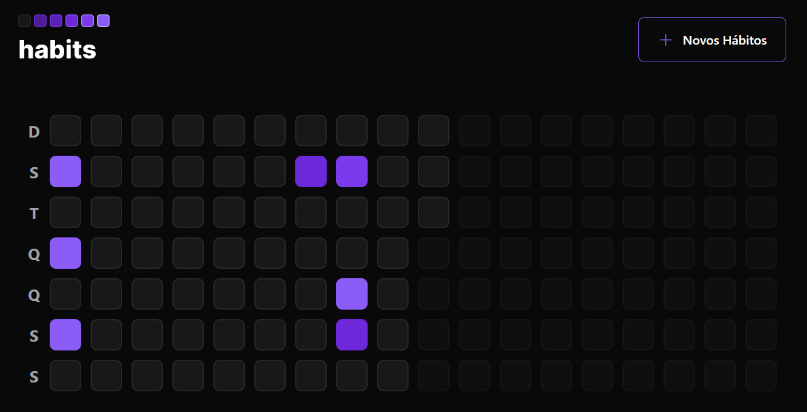
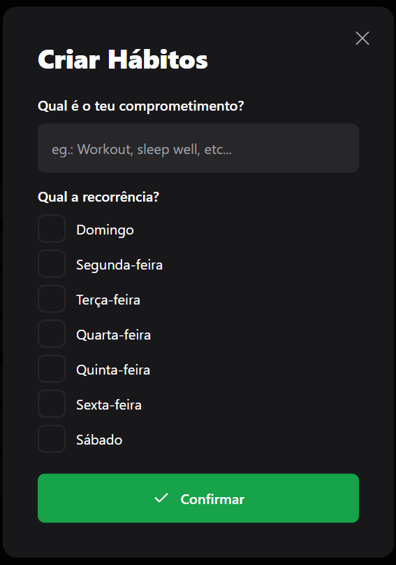
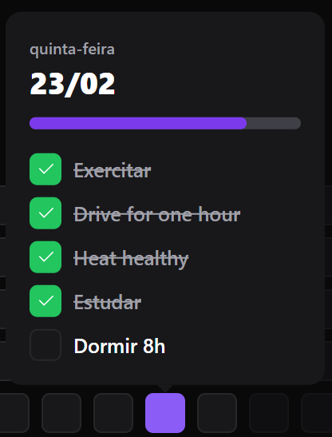

# Habits APP

## Introduction

This is an application that allows the user to control their activities (done and not done).

To use this application properly first the user have to create some habits and indicate the days that they wanted to do. After that he will return to the main page and will select the square of the present day (the other days are clickable too but only for visualization not for completing habits). After clicking in the day they can check the habit that they completed. As they are completing habits the color of the square will change (starts with zinc when theres no habits done, and then will be between a dark purple to a light purple according to habits completed) and the progress bar will change too.

This application have a server, that is the backend, a version to web and a version to mobile.

---

## Demonstration



This the main page where the days are shown. As you can see, the color of the squares isn't equal for every day, that is because that depends of the number of habits done in that day.

If the `Novos Hábitos` button were clicked, a modal will appear and allow the user to create a new habit.



In this modal the user will have to add a name to habit that he wants to create and then he chooses the days that he wants to do the habit and the «n hen the `Confirmar` button is clicked the habit will be created. Is worth mention that this habit won´t be available in past days, only in the present and future days.



This is what will appear whe you click on the square. If it is the present day the user will be allow to check and uncheck that will change the progress bar and the color of the square. If it is another day the user only be able to see the habits that are checked and unchecked.

For this demonstration it was used the web version. The mobile version have the same features and the interfaces is similar to this one.

---

## Frameworks and technologies used

- Server

  - Node.js
  - Fastify
  - Prisma

- Web

  - React.js
  - Vite
  - Tailwind

- Mobile
  - React Native
  - Expo
  - Nativewind

---

## Installation

### Server

```bash
# Clone this repository
$ git clone https://github.com/pipe102/habits-app.git

# Open terminal/cmd on the folder of the project
$ cd habits-app

# Move to the server folder
$ cd server

# Install dependencies
$ npm install
# Or in the case you use yarn
$ yarn install

# After installing the dependencies a .env file will need to be created that will have 2 variables
DATABASE_URL="file:./dev.db"
LOCALHOST_IP=192.xxx.x.xxx
# On the LOCALHOST_IP you have to use the ip of your computer because the mobile application can´t connect to localhost api

# Start using npm
$ npm run dev
# Start using yarn
$ yarn dev

# To access the server you will have to use <http://LOCALHOST_IP:33333>. The LOCALHOST_IP you have to change with the ip of your computer
```

### Web

```bash
# After starting the server

# Move to the server folder
$ cd web

# Install dependencies
$ npm install
# Or in the case you use yarn
$ yarn install

# Start using npm
$ npm run dev
# Start using yarn
$ yarn dev

# The access the web application is <http://localhost:5173>
```

### Mobile

```bash
# After starting the server

# Move to the mobile folder
$ cd mobile

# Install dependencies
$ npm install
# Or in the case you use yarn
$ yarn install

# Start using expo
$ npx expo start

# After doing this steps you can choose to open this application on your phone by reading th QRCode that will appear in the terminal or open it in a emulator
```

This project have one database that the I created for testing. If you wanted to use a different database you can create a new one wit the command:

```bash
$ npx prisma migrate dev --name init
```
